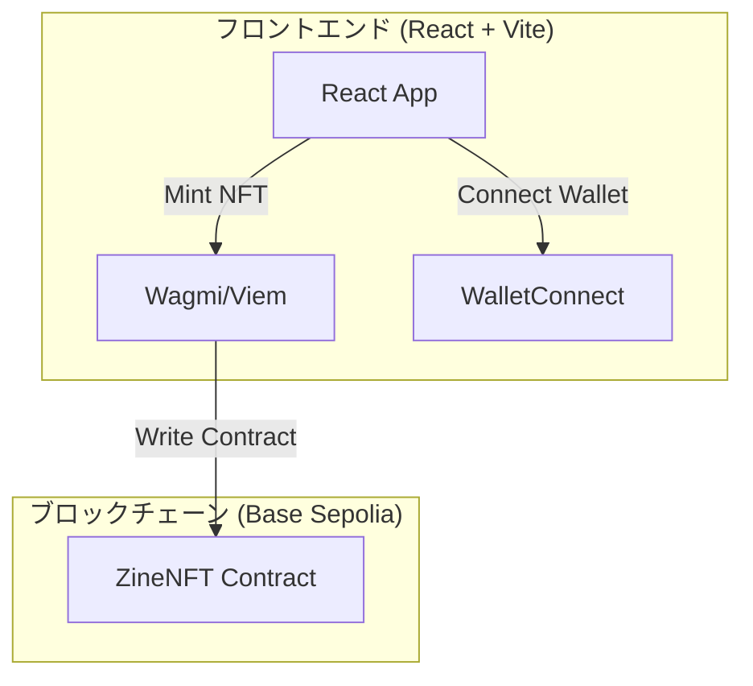

# zine dapp 設計書

## 概要

Base Sepoliaテストネットワーク上で動作する「zine dapp」の技術設計書です。ユーザーが書籍の書名を入力し、それに対応する所有権を証明するNFT（ERC-721）を発行するシンプルなWebアプリケーションです。

## アーキテクチャ

### システム全体構成



### レイヤー構成

1.  **プレゼンテーション層**: React (TypeScript, Vite)
2.  **Web3インタラクション層**: wagmi + viem
3.  **スマートコントラクト層**: Solidity + Hardhat
4.  **ブロックチェーン層**: Base Sepolia

## コンポーネントとインターフェース

### フロントエンドコンポーネント構成

```
pkgs/frontend/src/
├── App.tsx                 # メインアプリケーションコンポーネント
├── main.tsx                # アプリケーションエントリーポイント
├── components/
│   ├── layout/
│   │   └── Header.tsx      # ヘッダー（ウォレット接続ボタン含む）
│   └── ZineMinter.tsx      # 書名入力とNFT発行を行うカード
├── hooks/
│   └── useZineNFT.ts       # ZineNFTコントラクトとのインタラクション用カスタムフック
├── lib/
│   ├── wagmi.ts            # Wagmiの設定
│   └── constants.ts        # コントラクトアドレス等の定数
└── pages/
    └── HomePage.tsx        # ホーム画面
```

### スマートコントラクト構成

```
pkgs/contract/contracts/
└── ZineNFT.sol # 書籍所有権NFTコントラクト
```

### 主要インターフェース

#### IZineNFT.sol

```solidity
interface IZineNFT {
    function mint(address to, string memory bookTitle) external returns (uint256);
}
```

## データモデル

### フロントエンド型定義

```typescript
// hooks/useZineNFT.ts
export interface MintFunction {
  (bookTitle: string): Promise<void>;
}
```

## エラーハンドリング

### フロントエンドエラーハンドリング

```typescript
// components/ZineMinter.tsx

// wagmiのエラーハンドリングを利用
// isError, error を使ってUIにエラーメッセージを表示
// 例: 「トランザクションがキャンセルされました」「ガス代が不足しています」など
```

## テスト戦略

### スマートコントラクトテスト

```typescript
// pkgs/contract/test/ZineNFT.test.ts
describe('ZineNFT', () => {
  it('正常にNFTがミントされる', async () => {
    // テストロジック
  });

  it('書名が正しく記録される', async () => {
    // テストロジック
  });
});
```

### フロントエンドテスト

```typescript
// pkgs/frontend/src/components/ZineMinter.test.tsx
describe('ZineMinter', () => {
  it('書名入力フィールドが正常に動作する', () => {
    // テストロジック
  });

  it('ウォレット未接続時にはミントボタンが無効化される', () => {
    // テストロジック
  });
});
```

## 技術実装詳細

### Wagmi設定

```typescript
// pkgs/frontend/src/lib/wagmi.ts
import { createConfig, http } from 'wagmi';
import { baseSepolia } from 'wagmi/chains';
import { injected, metaMask } from 'wagmi/connectors';

export const config = createConfig({
  chains: [baseSepolia],
  connectors: [
    injected(),
    metaMask(),
  ],
  transports: {
    [baseSepolia.id]: http(),
  },
});
```

### カスタムフック実装

```typescript
// pkgs/frontend/src/hooks/useZineNFT.ts
import { useWriteContract } from 'wagmi';
import { zineNFTAbi } from '@/lib/abi'; // ABIは後で生成
import { ZINE_NFT_CONTRACT_ADDRESS } from '@/lib/constants';

export const useZineNFT = () => {
  const { writeContract, isPending, error } = useWriteContract();

  const mintNFT = async (bookTitle: string) => {
    return writeContract({
      address: ZINE_NFT_CONTRACT_ADDRESS,
      abi: zineNFTAbi,
      functionName: 'mint',
      args: [bookTitle], // to はコントラクト側で msg.sender を使う
    });
  };

  return {
    mintNFT,
    isPending,
    error,
  };
};
```